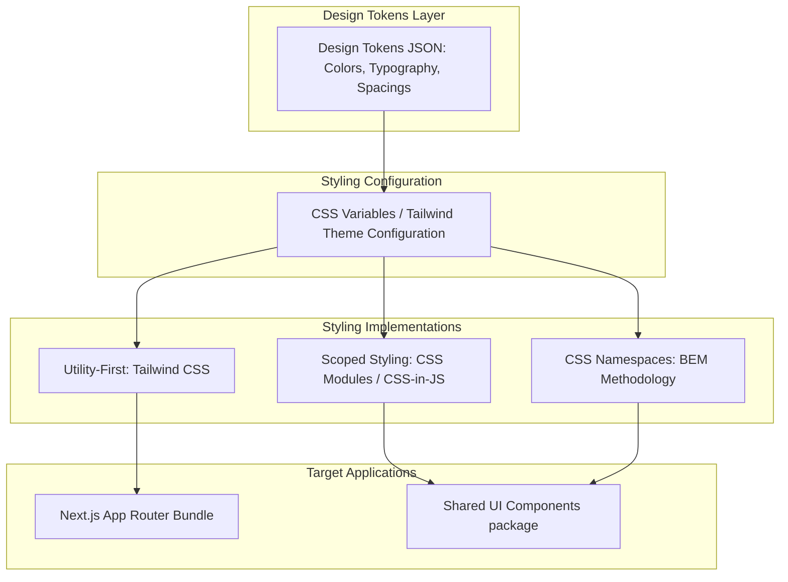

# System Design: Scalable CSS Architecture

As web applications scale to hundreds of components and support multiple developer teams, stylesheets grow and become difficult to manage. Unstructured CSS leads to global styles bleed (styles accidentally breaking other pages), massive bundle bloat, specificity wars, and unmaintainable code. Designing a scalable CSS architecture requires selecting clean namespace conventions (like BEM), styling isolation scopes (CSS Modules/Tailwind), and building centralized Design Tokens.

## Requirements

To support fast development, modular styling, and performance loops, a scalable CSS system must satisfy the following criteria:

### Functional Requirements
*   **Strict Isolation**: Styles defined for a component must not leak and break layouts elsewhere on the site.
*   **Design System Integration**: Component styles must inherit unified colors, borders, and spacings from a single source of truth (Design Tokens).
*   **Developer Autonomy**: Multiple developers must be able to write component styles in parallel without stylesheet conflicts.

### Non-Functional Requirements
*   **Minimized Bundle Size**: Restrict CSS build output size to keep network load times fast.
*   **Fast Rendering Speed**: Keep stylesheet selectors shallow to minimize browser style evaluation times.
*   **Optimized Build Pipelines**: Support incremental stylesheet compilation and unused styles removal (purging).

---

## High-Level Architecture

To scale styling across teams, modern organizations organize their stylesheets into a layered design system architecture:



---

## Design Deep Dive

### 1. BEM Namespace Methodology
BEM (Block, Element, Modifier) is a naming convention that prevents global style collisions in vanilla CSS by structuring class names hierarchically:
-   **Block**: Standalone entities (e.g. `.card`).
-   **Element**: Nested components belonging to the block (prefixed with double underscores, e.g. `.card__title`).
-   **Modifier**: Variations or state flags on the block/element (prefixed with double dashes, e.g. `.card__title--featured`, `.card--disabled`).
```css
/* BEM Standard Namespace Layout */
.card { background: #fff; }
.card__title { font-size: 1.5rem; }
.card__title--featured { color: #f59e0b; }
```

### 2. Styling Isolation: CSS Modules vs. Tailwind CSS
Modern scaling architectures choose between two styling isolation models:
*   **CSS Modules**: Component styles are written in scoped `.module.css` files. During the build, the compiler automatically renames classes with unique hash suffixes (e.g. `.card_title__x9a2f`). This guarantees absolute styles isolation.
*   **Utility-First (Tailwind CSS)**: Styles are built by composing predefined utility classes in HTML (e.g. `class="flex p-4 bg-zinc-950"`). This eliminates the need to write custom CSS files entirely, keeping your CSS bundle tiny and preventing global styles bleed.

### 3. Centralized Design Tokens
Design Tokens are a platform-agnostic single source of truth for design values (colors, spacing, typography). They are defined as a JSON file, which a build pipeline compiles into platform-specific format outputs (CSS Variables, Sass files, or iOS/Android asset configurations):
```json
{
  "color": {
    "primary": { "value": "#f59e0b" },
    "background": { "value": "#09090b" }
  }
}
```

---

## Real-World Example

### How Airbnb Scales CSS
Airbnb manages millions of lines of styles across multiple web applications. They standardize on **CSS-in-JS** and **CSS Modules** for absolute styling isolation, ensuring that developers can edit component styles in parallel without code collisions. They compile dynamic token configurations (Design Tokens) from Figma exports into Javascript variables, feeding theme specifications directly into their React UI package libraries to ensure visual consistency across all applications.

---

## Key Takeaways

*   Global style bleed can be resolved by using BEM namespaces or CSS Modules isolation.
*   Tailwind CSS keeps styling bundles minimal by compiling only the utility classes used on the site.
*   Design Tokens serve as the single source of truth for color and spacing properties.
*   Keep selectors shallow to speed up browser styling computations.
