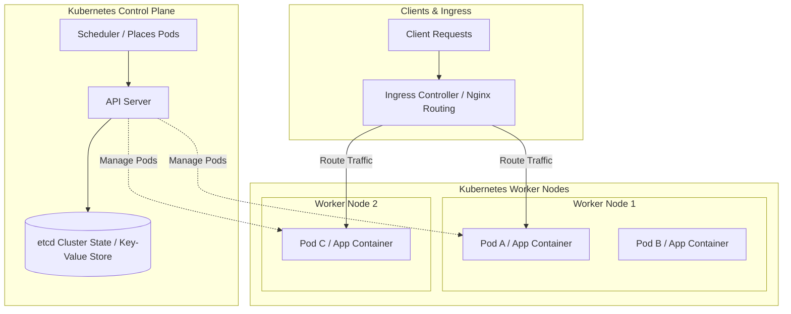

# System Design: Container Orchestration at Scale

As backend applications scale to handle high traffic, managing hundreds of containers manually across multiple virtual machines is impossible. If a container crashes, it must be restarted instantly; if traffic spikes, containers must scale out. A **Container Orchestration System** (like Kubernetes) solves this by managing container deployments, scaling, networking, and resource allocation dynamically.

## Requirements

To coordinate containers across server clusters, an orchestration system must satisfy the following criteria:

### Functional Requirements
*   **Self-Healing Containers**: Detect container failures and restart instances automatically to maintain service availability.
*   **Horizontal Auto-Scaling**: Scale container counts dynamically based on CPU/memory usage.
*   **Service Discovery & Load Balancing**: Expose groups of containers using a stable DNS name and distribute traffic evenly.
*   **Zero-Downtime Deployments**: Deploy application updates without causing service downtime.

### Non-Functional Requirements
*   **Resource Optimization**: Distribute containers across hosts to maximize CPU and memory utilization.
*   **Fault Tolerance**: Ensure the cluster remains available even if physical worker nodes crash.
*   **Configuration Isolation**: Separate application configurations from container images.

---

## High-Level Architecture

Kubernetes coordinates containers using a control plane node and multiple worker nodes, routing client traffic through ingress gateways:

---

## Design Deep Dive
### 1. Kubernetes Building Blocks: Pods, Deployments, and Services
Kubernetes abstracts container management using specific building blocks:
-   **Pod**: The smallest deployable unit in Kubernetes. A wrapper around one or more closely related containers that share the same IP address and storage volume.
-   **Deployment**: A controller that defines the desired state of your pods (e.g. running 5 replicas of an API container). It manages rolling updates, replacing old pods with new ones gradually.
-   **Service**: A stable network entry point that routes traffic to a set of pods using labels, balancing requests across instances.

### 2. Zero-Downtime: Rolling Updates vs. Blue-Green
Kubernetes enables zero-downtime updates using specific strategies:
-   **Rolling Update (Default)**: Replaces old pods with new ones gradually. On startup, new pods undergo health checks. If they pass, old pods are terminated, ensuring active instances are always available to handle traffic.
-   **Blue-Green Deployment**: Runs two identical environments. The active environment (Blue) handles production traffic. You deploy the update to the secondary environment (Green) and test it. Once verified, you switch routing instantly to Green, enabling fast rollbacks if issues occur.

### 3. Resource Allocation & Autoscaling
Manage resource allocation to prevent pods from starving others of host resources. Define resource limits in pod specifications:
-   `requests`: The minimum CPU and memory resources required to run the container.
-   `limits`: The maximum CPU and memory resources the container is allowed to consume.
Use the **Horizontal Pod Autoscaler (HPA)** to scale pod replica counts automatically based on CPU and memory usage.

---

## Real-World Example
### How Spotify Scales Container Orchestration
Spotify runs thousands of microservices in containers. Originally, they built a custom orchestration engine called Helios. As the industry standardized, they migrated to **Kubernetes** to manage their container clusters at scale. Today, they manage thousands of pods, routing traffic through Ingress controllers, scaling instances dynamically using the HPA, and utilizing rolling updates to deploy code changes with zero downtime.

---

## Key Takeaways

*   Kubernetes manages container deployments, scaling, and networking at scale.
*   Pods wrap containers; Deployments manage rolling updates; Services route and load-balance traffic.
*   Implement rolling updates to update application versions with zero downtime.
*   Define CPU and memory limits to prevent containers from starving host resources.
