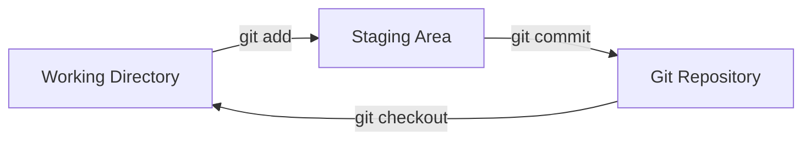

# Basic Git Commands 🛠️

To master Git, you must understand the core lifecycle flow: creating or importing a repository, tracking files, checking file states, committing changes, and viewing project history.

## The Three States Architecture

Git has three main states that your files can reside in:
1.  **Working Directory**: The actual files that you are editing on your disk.
2.  **Staging Area (Index)**: A file/cache managed by Git that holds the changes prepared for the next commit.
3.  **Git Directory (Repository)**: Where Git stores the metadata and database for your project (stored in the hidden `.git/` folder).



---

## 1. Initializing a Repository

To turn an existing directory into a Git repository:
```bash
git init
```
This creates a hidden `.git/` directory containing all your repository tracking files.

## 2. Cloning an Existing Repository

To clone a remote repository (from GitHub, GitLab, etc.) to your local machine:
```bash
git clone https://github.com/user/repo.git
```
This automatically initializes Git, configures the remote origin server, and downloads all history and branches.

## 3. Checking Project Status

Check the state of your working directory and staging area:
```bash
git status
```
It shows which files have been modified, which are staged for the next commit, and which are completely untracked.

## 4. Staging Changes

To add files from the working directory to the staging area:
```bash
# Stage a specific file
git add main.js

# Stage all files (new, modified, and deleted)
git add .
```

## 5. Committing Snapshots

To record your staged changes in the Git database:
```bash
git commit -m "feat: implement user authentication endpoint"
```

<Callout type="tip" title="Write Clear Commit Messages">
  Prefer the imperative mood ("feat: add search" rather than "added search") to align with Git's generated commits (like "Merge pull request"). Keep the first line under 50 characters, and explain *why* rather than *what* in description details.
</Callout>

## 6. Inspecting History

To view the chronological list of commits:
```bash
# View full history
git log

# View a compact, single-line representation
git log --oneline --graph --decorate
```
