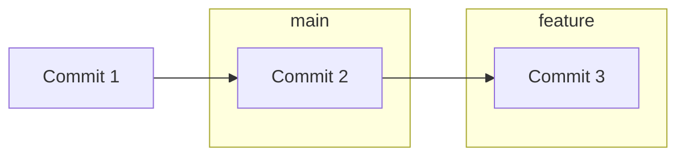
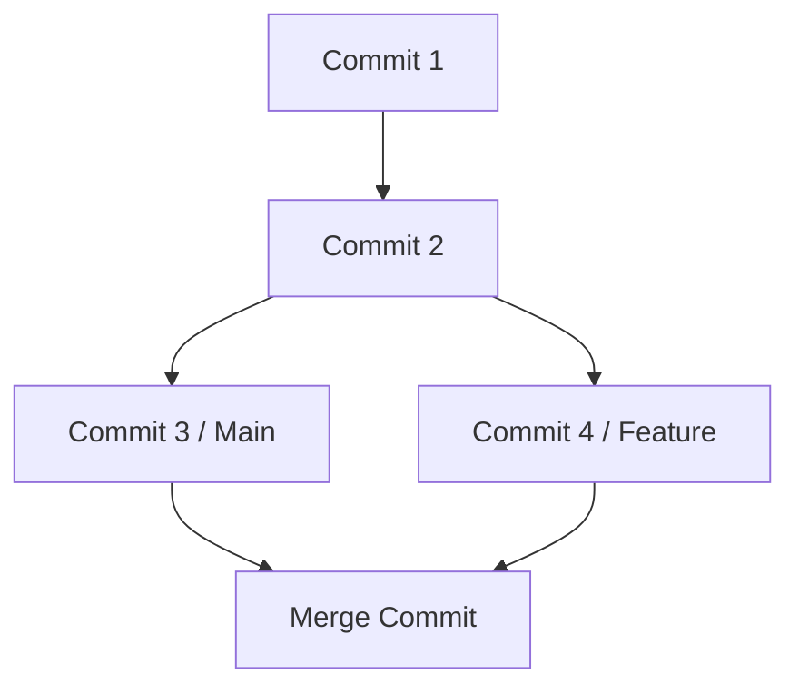

# Branching & Merging 🌿

Branching in Git is incredibly lightweight. A branch is simply a pointer to a specific commit. Because Git doesn't copy files when branching, creating or deleting branches takes less than a second.

## Core Commands

### 1. Creating and Viewing Branches
```bash
# List all local branches (current branch highlighted)
git branch

# Create a new branch named 'feature-auth'
git branch feature-auth
```

### 2. Switching Between Branches
Historically, developers used `git checkout` to switch branches. Git 2.23 introduced `git switch` specifically for changing branches to reduce tool overloading:

```bash
# Switch to 'feature-auth'
git switch feature-auth

# Shortcut: Create AND switch to a new branch in one command
git switch -c feature-dashboard
```

### 3. Deleting Branches
Delete branches that have been merged and are no longer needed:
```bash
git branch -d feature-dashboard
```

---

## Merging Branches

Merging takes two separate histories and combines them. To merge a branch (e.g. `feature-auth`) into your current branch (e.g. `main`):

```bash
# First, make sure you are on the target branch
git switch main

# Perform the merge
git merge feature-auth
```

### Merging Mechanisms

Git determines the merge type based on the commits graph:

#### 1. Fast-Forward Merge
If the target branch pointer (e.g., `main`) hasn't moved since you branched off, Git simply moves the pointer forward to your new commit. No merge commit is created.



#### 2. Three-Way (Recursive) Merge
If `main` has progressed with other commits in the meantime, Git creates a new commit—a **Merge Commit**—that has two parent commits, representing the union of both paths.



<Callout type="note" title="Configuring Merge Commits">
  You can force Git to create a merge commit even during a fast-forward merge by adding the `--no-ff` flag. This preserves history and groups the commits clearly as a feature block.
  ```bash
  git merge --no-ff feature-auth
  ```
</Callout>
