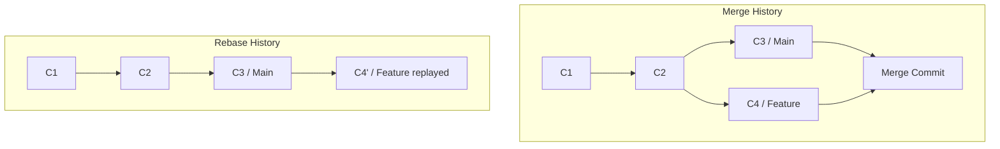

# Stash & Rebase 📦

Git provides advanced tools to save unfinished workspace changes quickly and rewrite commit history to maintain a clean linear progression.

## Stashing: Saving Temporary Work

Sometimes you need to switch branches but aren't ready to commit your half-written code. `git stash` takes your uncommitted changes (both staged and unstaged) and saves them on a stack, cleaning your working directory.

```bash
# Save active changes to the stash stack
git stash

# Save with a custom descriptive message
git stash save "WIP: login page validation styles"

# List all saved stashes
git stash list
```

### Retrieving Stashed Changes
```bash
# Apply the latest stash and REMOVE it from the stack
git stash pop

# Apply a specific stash (by index) without removing it
git stash apply stash@{0}

# Delete a specific stash
git stash drop stash@{0}

# Delete all stashes
git stash clear
```

---

## Rebasing: Linearizing History

Rebasing is the process of moving or combining a sequence of commits to a new base commit. Instead of combining branches via a merge commit, rebasing rewrites the project history by replay commits on top of another branch.

```bash
# Rebase current branch on top of main
git switch feature-auth
git rebase main
```



### Interactive Rebase: Cleaning Commits
You can use interactive rebasing (`-i`) to squash, rename, or delete past commits before pushing them to shared repositories:

```bash
# Rebase the last 4 commits on current branch
git rebase -i HEAD~4
```
This opens your text editor with options:
- `pick`: keep the commit.
- `reword`: change the commit message.
- `edit`: stop and modify files.
- `squash`: merge commit into the previous one.

<Callout type="danger" title="The Golden Rule of Rebasing">
  **Never rebase commits that you have pushed to a public repository.** Rebasing rewrites commit SHA hashes. If you rebase public commits, other developers who pulled your commits will have divergent histories, resulting in complex and painful merge loops.
</Callout>
