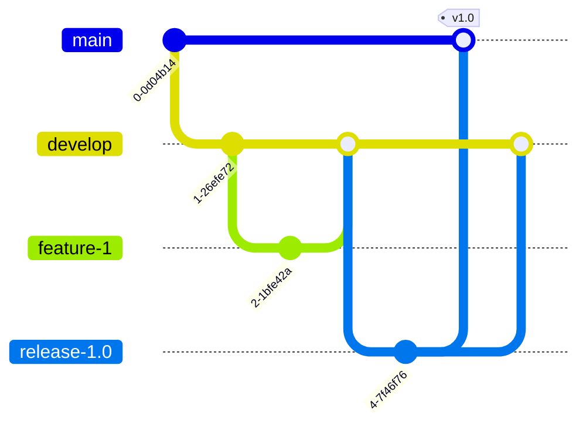

# System Design: Git Workflows at Scale 📊

Selecting the right Git branching model is crucial for maintaining rapid integration, reliable testing pipelines, and clean deployment gates across engineering teams.

## Branching Models Comparison

### 1. Git Flow (Classic Release Model)
A structured model featuring two long-lived branches (`main` and `develop`) and supporting branches (`feature/`, `release/`, `hotfix/`).

-   **Pros**: Excellent for scheduled releases, strict QA phases, and multi-version production support.
-   **Cons**: High merge complexity, long-lived feature branches, and slow integration cycles.

### 2. GitHub Flow (Continuous Delivery Model)
A lightweight model where everything branches off `main` (using descriptive names like `feature/login`), and merges back via Pull Requests. `main` is always deployable.
-   **Pros**: Simple, highly compatible with continuous deployment (CD), fast feedback.
-   **Cons**: Harder to manage if you support multiple release versions simultaneously.

### 3. Trunk-Based Development (Continuous Integration Model)
Developers merge small, frequent commits directly into a single central branch (`trunk` or `main`). Feature branches are extremely short-lived (less than a day), and features are hidden behind **Feature Flags** if not ready.
-   **Pros**: True Continuous Integration, minimal merge conflicts, fast time-to-market.
-   **Cons**: Requires high test coverage and mature feature flag systems.

---

## Git Best Practices for Teams

1.  **Commit Often, Commit Small**: Group logical changes together. Avoid huge commits that modify 50 files across different modules.
2.  **Pull/Rebase Before Pushing**: Keep your local history updated to prevent race conditions during pushing.
3.  **Use `.gitignore` Correctly**: Never commit API keys, `.env` files, build caches (`/dist`, `/.next`), or packages (`/node_modules`).
4.  **Enforce Branch Protection**: Protect `main` from direct pushes. Require linear histories, status checks passing (CI), and Peer approvals (PR reviews).
