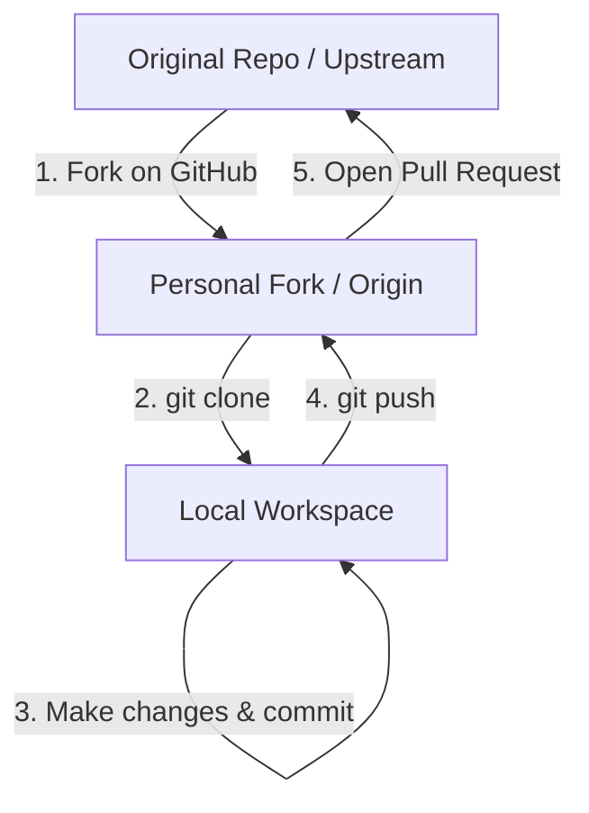

# Forking & Open Source Contribution 🌐

Forking is the process of creating a personal copy of another user's repository on your own GitHub account. This is the cornerstone of open-source contribution, allowing you to freely experiment and make changes without affecting the original project.

## The Fork-and-Pull Workflow



---

## Step-by-Step Contribution Guide

### Step 1: Fork the Repository
On GitHub, navigate to the target repository (e.g., `facebook/react`) and click the **Fork** button in the top-right corner.

### Step 2: Clone Your Fork Locally
Clone your personal copy (which is your `origin` remote):
```bash
git clone git@github.com:your_username/react.git
```

### Step 3: Configure the Upstream Remote
To pull updates from the original repository (which is your `upstream` remote) in the future:
```bash
# Add upstream remote pointing to the original repository
git remote add upstream https://github.com/facebook/react.git

# Verify remotes
git remote -v
# origin   git@github.com:your_username/react.git (fetch/push)
# upstream https://github.com/facebook/react.git (fetch/push)
```

---

## Keeping Your Fork in Sync

Before you make any new changes, ensure your local main branch is updated with the latest changes from the upstream project:

```bash
# Fetch changes from upstream
git fetch upstream

# Switch to local main branch
git switch main

# Merge upstream changes into your main branch
git merge upstream/main

# Push updates to your personal GitHub copy
git push origin main
```

---

## Submitting Your Contribution
1.  Create a feature branch: `git switch -c fix/docs-typo`
2.  Commit your edits: `git commit -m "docs: correct typo in hooks API page"`
3.  Push to your fork: `git push origin fix/docs-typo`
4.  Go to the original project's GitHub page. You will see a banner prompting you to open a **Pull Request** from your fork. Complete the details and submit!
