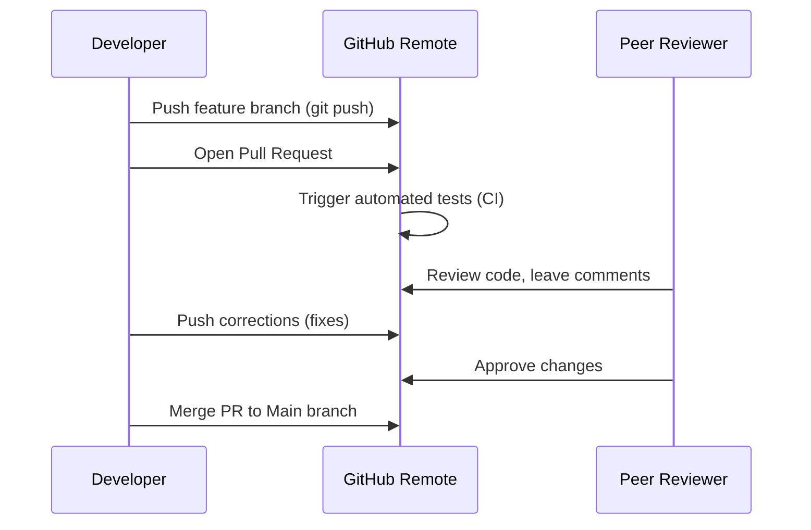

# Pull Requests & Code Reviews 👥

Pull Requests (PRs) are the heart of GitHub's collaborative model. They allow you to show other developers the code changes you have pushed to a branch, request their feedback, and merge the code into the main branch.

## The PR Lifecycle



### 1. Creating a Pull Request
After making local changes on a branch (e.g. `feature-login`), push the branch to GitHub:
```bash
git push -u origin feature-login
```
Click the **"Compare & pull request"** button that appears on your GitHub repository landing page. Fill out a clear description detailing *what* was changed and *why*.

---

## Code Review Workflows

As a reviewer, you can open a PR's **Files changed** tab to inspect changes line-by-line:
-   **Inline Comments**: Hover over a line of code and click the blue `+` button to leave a comment or suggest a change.
-   **Review Submission**: Click **Review changes** and choose:
    -   *Comment*: Leave general feedback without approving or blocking.
    -   *Approve*: Approve the PR, allowing it to be merged.
    -   *Request changes*: Block the PR from being merged until the developer resolves your feedback.

---

## PR Merging Strategies

GitHub supports three merging methods. Choosing the right one depends on your team's workflow strategy:

### 1. Create a Merge Commit
Merges all branch commits into `main` and creates a special merge commit.
-   *Pros*: Preserves the history of commits exactly as they occurred.
-   *Cons*: Can make the commit history graph messy.

### 2. Squash and Merge
Combines all commits from the PR into a single, clean commit on `main`.
-   *Pros*: Cleans up intermediate commits (like "typo fix" or "WIP").
-   *Cons*: Loses the individual granular step history.

### 3. Rebase and Merge
Replays all commits individually on top of `main` without creating a merge commit.
-   *Pros*: Creates a completely linear project history.
-   *Cons*: Harder to audit which group of commits belonged to a specific feature.

<Callout type="tip" title="Suggested Strategy">
  For most product development teams, **Squash and Merge** is recommended for feature branches, keeping the `main` branch commit log clean and readable.
</Callout>
