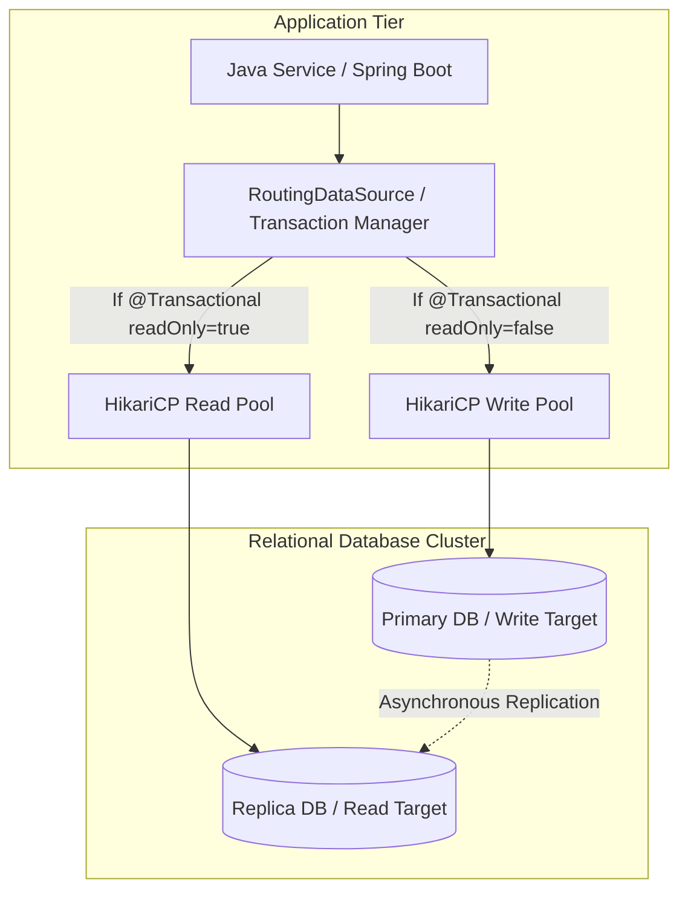

# System Design: Database Access Layer at Scale

When database traffic scales, the database access layer often becomes the primary bottleneck. As traffic grows, executing too many unoptimized queries or holding open database connections can exhaust connection pools, saturate database CPU, and cause application-wide timeouts. Designing a scalable database access layer requires implementing connection pooling, separating read and write traffic (read-write splitting), routing requests dynamically, and optimizing caching tiers.

## Requirements

To handle high traffic loads while keeping query latency low and database connections stable, the database access layer must satisfy the following criteria:

### Functional Requirements
*   **Dynamic Connection Routing**: Route database traffic dynamically based on operation types (reads vs. writes).
*   **Resource Protection**: Prevent connection pool exhaustion under sudden traffic spikes.
*   **Cache Synchronization**: Maintain data consistency between cache tiers and the database.

### Non-Functional Requirements
*   **Query Latency**: Keep database query latency under 50ms.
*   **Throughput Sizing**: Support thousands of concurrent queries without connection exhaustion.
*   **Maximized Read Availability**: Scale read capacity horizontally using database replicas.

---

## High-Level Architecture

A scalable database access layer routes traffic through dynamic data sources, sending writes to the primary database and reads to read-replicas:



---

## Design Deep Dive

### 1. Read-Write Splitting & Dynamic Routing
To scale database capacity, separate read and write operations. Set up a database cluster with a primary write database and multiple read-replicas:
-   **Primary Database**: Handles all write transactions (`INSERT`, `UPDATE`, `DELETE`). Updates are replicated asynchronously to read-replicas.
-   **Read-Replicas**: Handle all read-only transactions (`SELECT`).
In Spring Boot, implement a custom `AbstractRoutingDataSource` that inspects the active transaction state. If a method is annotated with `@Transactional(readOnly = true)`, route the query to the read-replica pool; otherwise, route it to the primary database pool.

### 2. Connection Pool Tuning: The Formula
Sizing connection pools correctly is critical to prevent connection exhaustion. Use the PostgreSQL-recommended connection sizing formula:
```
Connections = (Number of CPU Cores * 2) + Effective Spindle Count
```
Configuring a connection pool (like **HikariCP**) with small, optimized pool sizes (e.g., 10–20 connections per instance) avoids database context switching overhead. This allows the database to process queries sequentially with maximum efficiency.

### 3. Bulk Loading & Write Optimizations
When persisting large batches of data (e.g., importing CSV logs or processing nightly updates), avoid executing sequential `INSERT` statements. Optimize write operations by enabling batch insert properties in your configuration:
```properties
spring.jpa.properties.hibernate.jdbc.batch_size=50
spring.jpa.properties.hibernate.order_inserts=true
spring.jpa.properties.hibernate.order_updates=true
```
This allows Hibernate to group sequential inserts into batch executions, reducing network roundtrips between the application and the database.

---

## Real-World Example
### How Uber Scales Database Access Layers
Uber manages massive database clusters. They isolate database access using a custom routing layer called **Schemaless**, which partitions data across database shards and routes queries dynamically based on customer UUIDs. They use caching tiers (Redis) to offload read traffic from primary databases, connection pooling configurations (HikariCP) to optimize database handles, and rate limiting to prevent traffic spikes from overwhelming the persistence layer.

---

## Key Takeaways

*   Scale read capacity horizontally using read-replicas and dynamic routing.
*   Use small, optimized connection pool sizes to prevent database context switching overhead.
*   Enable batch insert properties (`batch_size`) to optimize bulk write operations.
*   Implement distributed caching to offload queries from primary databases.
