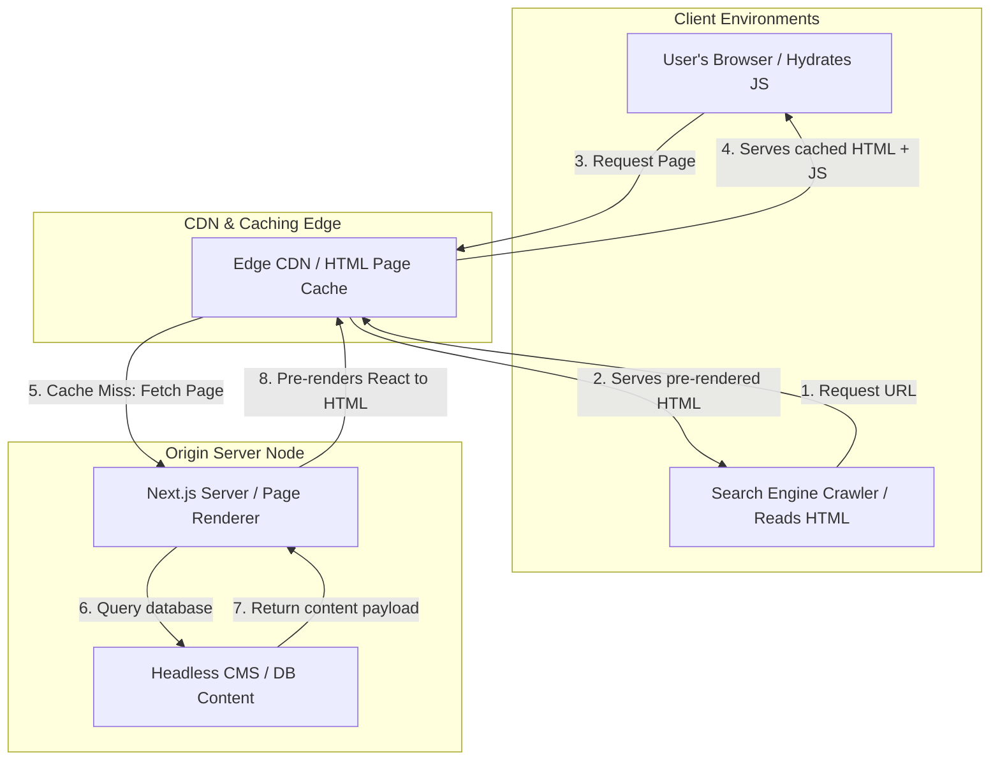

# System Design: Accessible & SEO-Friendly Pages

For large-scale public websites (like e-commerce platforms, news portals, and technical documentation hubs), visibility on search engines and accessibility compliance are primary business requirements. If search engine crawlers (like Googlebot) cannot index page contents efficiently, or if the website fails accessibility compliance audits, organic traffic drops and legal risks rise. Designing for high traffic requires architecting crawlers-ready static pages, structured schema payloads, semantic landmarks, and fast performance loops.

## Requirements

To ensure optimal visibility, search rankings, and accessibility compliance, the system must meet the following requirements:

### Functional Requirements
*   **Search Crawler Compatibility**: Deliver fully rendered HTML to bots during search indexes discovery.
*   **Structured Metadata Mapping**: Render dynamic Open Graph, Twitter Card, and JSON-LD schema payloads per page.
*   **Global Accessibility Standards**: Conform to WCAG 2.2 AA standards (including full keyboard navigability and aria landmark maps).
*   **Dynamic XML Sitemaps**: Auto-generate sitemap links updated in real-time as content is added or modified.

### Non-Functional Requirements
*   **First Contentful Paint (FCP)**: Serve initial visible HTML structures in under 1.0 seconds.
*   **Cumulative Layout Shift (CLS)**: Maintain a visual shifting score below 0.1 to avoid content jumping.
*   **Core Web Vitals compliance**: Maintain a Lighthouse score above 90 across Mobile and Desktop formats.

---

## High-Level Architecture

To deliver fast load times and crawlable content, large-scale systems use **Server-Side Rendering (SSR)** or **Static Site Generation (SSG)** to pre-render pages, rather than relying on Client-Side Rendering (CSR) where the browser constructs the page dynamically.



---

## Design Deep Dive

### 1. Rendering Strategy Selection
Choosing the right rendering model affects how search engine crawlers index your pages:
*   **Client-Side Rendering (CSR)**: Search crawlers must download and execute a large JS bundle to see the page content. While Googlebot can process JavaScript, it does so in a delayed "second wave" of indexing. Other search engines (like Bing or DuckDuckGo) may fail to index the page entirely. **Do not use CSR for public-facing content.**
*   **Static Site Generation (SSG)**: Pre-renders pages into static HTML files at build time. This is the fastest, most secure, and most SEO-friendly approach, making it ideal for documentation sites and blogs.
*   **Server-Side Rendering (SSR)**: Generates HTML on the fly for each request. Use this when the page displays highly dynamic, user-specific data that must be crawled in real-time (like product pricing or inventory levels).

### 2. Structured Data Integration: JSON-LD Schema
Search engines read structured metadata to display rich search results (like star ratings, pricing, and FAQ dropdowns). Integrate **JSON-LD** schema metadata directly in the page's `<head>` as a JSON payload:

```html
<script type="application/ld+json">
{
  "@context": "https://schema.org",
  "@type": "TechArticle",
  "headline": "System Design: Accessible & SEO-Friendly Pages",
  "description": "Architect web structures to optimize indexing crawlers.",
  "author": {
    "@type": "Person",
    "name": "Mahesh Shelake"
  },
  "publisher": {
    "@type": "Organization",
    "name": "DevDocs Hub"
  }
}
</script>
```

### 3. Cumulative Layout Shift (CLS) Mitigation
Layout shifts occur when visual elements move on the screen as the page loads (e.g. when an ad or image loads and pushes text down). This degrades user experience and hurts search rankings. Prevent layout shifts by:
*   Declaring explicit `width` and `height` dimensions on images.
*   Reserving space for ads or dynamic banners using CSS minimum heights.
*   Pre-loading custom web fonts to prevent text jumping when the font file finishes downloading.

---

## Real-World Example

### How Amazon Optimizes for SEO and Web Vitals
Amazon processes millions of product pages daily. To maintain organic search placement, they pre-render all product catalogs into optimized HTML at the edge CDN level. They enforce strict CLS budgets, reserving static block areas for product pictures and banners to prevent layout shifts. They output structured Product and Review JSON-LD schemas in the head of each page, enabling Google to display price tags and rating stars directly in search engine results pages (SERPs).

---

## Key Takeaways

*   Pre-render pages using SSG or SSR to ensure indexing crawlers can read content immediately.
*   Inject JSON-LD schemas to enable rich search result snippets.
*   Add viewport meta configurations and declare image dimensions to prevent layout shifts.
*   Ensure full keyboard navigability and WCAG AA compliance to support screen readers.
