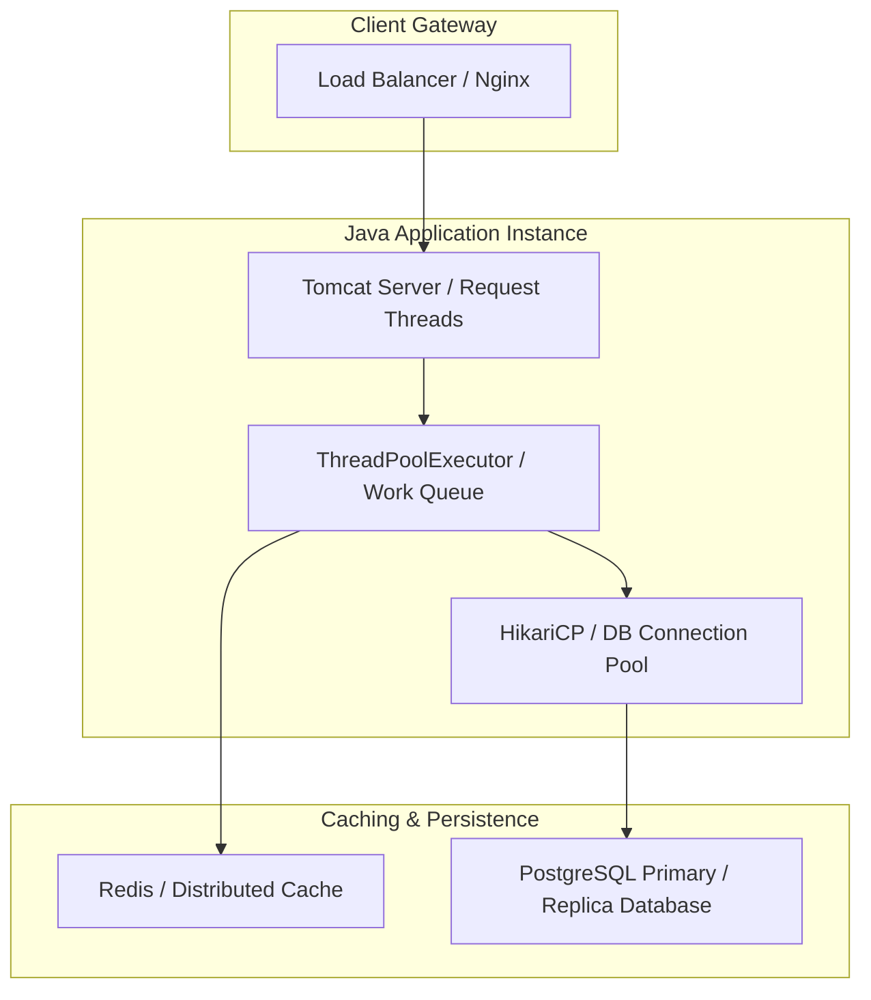

# System Design: Scalable Java Backend

Building a scalable Java backend requires addressing concurrency models, resource scaling, database connection pooling, and JVM memory tuning. When backend traffic scales to thousands of concurrent requests, bad thread configurations or unoptimized Garbage Collection parameters will cause application timeouts, memory leaks, and CPU exhaustion. Designing for scale requires optimizing thread pools, tuning garbage collection parameters, and implementing cache architectures.

## Requirements

To handle high traffic loads while maintaining fast response times, a scalable Java backend must satisfy the following criteria:

### Functional Requirements
*   **Thread Pool Orchestration**: Reuse connections and manage concurrent threads using bounded execution queues.
*   **Database Connection Pooling**: Avoid connection bottlenecks by caching database handles.
*   **Distributed Caching**: Keep response times low by caching frequently queried data in memory.

### Non-Functional Requirements
*   **Response Latency**: Maintain p99 API latencies under 200 milliseconds.
*   **Ultra-Low GC Pause Times**: Keep Garbage Collection stop-the-world pauses under 10ms.
*   **Maximized Throughput**: Support thousands of requests per second (RPS) without thread exhaustion.

---

## High-Level Architecture

A scalable Java backend uses a layered architecture, using thread pools and cache layers to decouple request handling from database operations:



---

## Design Deep Dive

### 1. Thread Pool Sizing: The Formula
Avoid using unbounded thread pools, which can exhaust system resources and crash your application. Size your pools based on the nature of the tasks:
-   **For CPU-Bound Tasks** (e.g. cryptography, image processing): Size the pool based on available CPU cores:
    ```
    Threads = Number of CPU Cores + 1
    ```
-   **For I/O-Bound Tasks** (e.g. database queries, calling external APIs): Threads spend most of their time waiting for network responses. Size the pool based on wait and processing times:
    ```
    Threads = Number of CPU Cores * (1 + (Wait Time / Processing Time))
    ```
Enforce these boundaries using a `ThreadPoolExecutor` with a bounded work queue (e.g. `ArrayBlockingQueue`) and configured rejection policies.

### 2. Database Connection Pooling: HikariCP
Creating database connections is expensive. Use a connection pool (like **HikariCP**, the default in Spring Boot) to cache open database handles. Tune parameters based on database limits:
-   `maximum-pool-size`: Limit the pool size to prevent database connection exhaustion (typically 10–20 connections per instance).
-   `connection-timeout`: Set a timeout (e.g. 30 seconds) to prevent threads from waiting indefinitely for a database connection.

### 3. JVM Tuning & GC Settings
Tune your JVM memory and Garbage Collection settings to prevent memory exhaustion and minimize pause times:
-   **Set Memory Limits**: Ensure minimum (`-Xms`) and maximum (`-Xmx`) heap sizes match (e.g. `-Xms4g -Xmx4g`) to prevent performance overhead from dynamic heap resizing.
-   **Set GC Collector**: Standardize on G1GC or ZGC for modern JDKs:
    `java -XX:+UseG1GC -XX:MaxGCPauseMillis=20 -jar app.jar`
  This instructs G1GC to target maximum stop-the-world pauses of 20 milliseconds.

---

## Real-World Example

### How Netflix Scales Java Backends
Netflix runs thousands of microservices in Java. They use **Zuul** as an edge service gateway to route and load-balance requests. To optimize performance, they use **HikariCP** for connection pooling and **ZGC** to keep Garbage Collection pause times under 1ms, preventing latency spikes. They also implement circuit breakers (via resilience4j) to prevent failures in one microservice from cascading and taking down other services.

---

## Key Takeaways

*   Size thread pools based on task types (CPU-bound vs I/O-bound) to prevent resource exhaustion.
*   Use HikariCP to manage and cache database connections.
*   Set explicit JVM heap limits and target GC collectors (like G1GC or ZGC).
*   Implement circuit breakers to isolate failures and maintain system availability.
