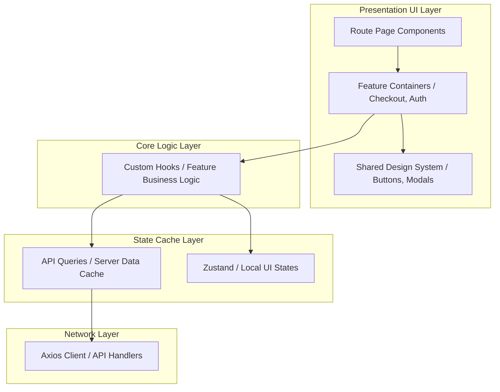

# System Design: Structuring a Scalable Frontend

As frontend applications grow to support multiple developer teams, they face complex architectural challenges. Without structured designs, code bases deteriorate into coupled components, page load times slow down, and bundle sizes bloat. Designing a scalable frontend requires implementing modular feature folders, separating client/server states, and optimizing bundler pipelines.

## Requirements

To ensure fast user interaction, team autonomy, and codebase maintainability, the frontend architecture must satisfy the following criteria:

### Functional Requirements
*   **Modular Domain Features**: Separate business logic into self-contained feature folders (e.g. `features/checkout`, `features/auth`).
*   **Centralized Design System**: Decouple shared UI elements (buttons, inputs) from business domain features.
*   **State Boundaries Isolation**: Separate server API caches from client UI state stores.

### Non-Functional Requirements
*   **Optimized Performance**: Achieve a First Contentful Paint (FCP) under 1.5 seconds.
*   **Scale Build Times**: Keep production compilation build times under 3 minutes using incremental cache setups.
*   **Minimal Initial Bundle Sizes**: Leverage code-splitting to load page-specific JavaScript bundles only when requested.

---

## High-Level Architecture

Scalable frontends organize code hierarchically into independent layers, separating business domains from shared infrastructure:

---

## Design Deep Dive

### 1. Feature-First Folder Organization
Instead of grouping files strictly by technical type (e.g. placing all hooks in one folder, all pages in another), organize code by business domains. Each feature contains its own private components, hooks, and API fetch calls, and exports a clean public API through an `index.ts` file. This prevents tight coupling and lets different developer teams work on separate features without codebase conflicts.

### 2. Strict State Separation
Avoid putting all application data in a single global store. Split your state into three distinct buckets:
-   **Local UI State**: Kept local to components using standard hooks (like `useState`).
-   **Server Cache State**: Handled using query-caching libraries (like React Query or RTK Query) to manage API requests and data synchronization.
-   **Global Client State**: Kept in lightweight stores (like Zustand or Redux Toolkit) to manage global settings (like user settings, theme, or cart state).

### 3. Build Optimizations & Code Splitting
To optimize page load times, load JavaScript bundles dynamically. Split your application at the route level using dynamic imports, loading page assets only when the user navigates to that route. Use modern build tools (like Vite or Webpack loaders) to compile code using incremental caching.

---

## Real-World Example

### How Meta Scales Frontends
Meta manages massive React codebases. They isolate UI components into a shared package (`packages/ui`) that uses design tokens to ensure visual consistency across applications. To optimize load times, they use dynamic bundle loading, lazy route imports, and query-caching layers. They also enforce strict ESLint rule checks to prevent cross-feature imports, allowing hundreds of developers to push changes to different micro-features daily without triggering cascade build errors.

---

## Key Takeaways

*   Structure codebases by feature domains to keep them scalable and maintainable.
*   Enforce strict public APIs (`index.ts`) to prevent tight feature coupling.
*   Separate server API caches from global client state stores.
*   Use route-level code-splitting to minimize initial page load times.
