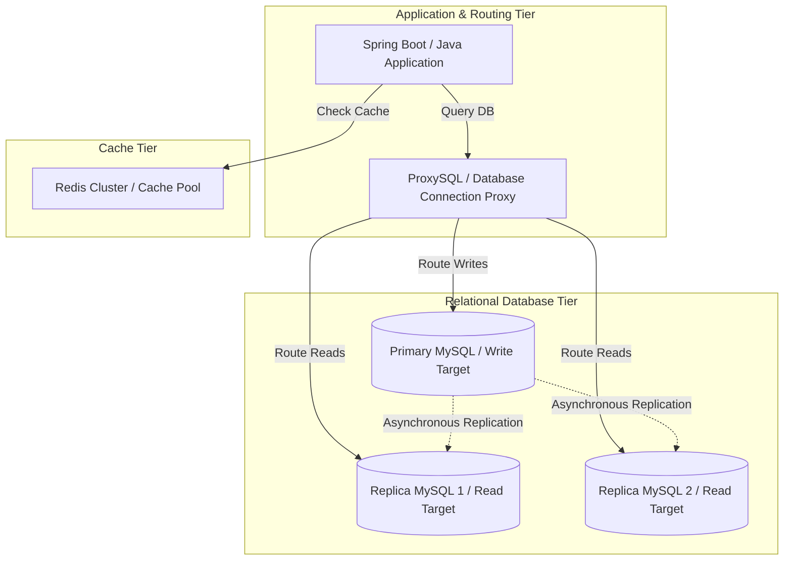

# System Design: Scaling MySQL for High-Traffic Platforms

When backend applications scale, the database tier is often the hardest component to scale. Unlike stateless application servers that can be scaled out easily, database engines maintain state, requiring connection pooling, caching, and replication architectures to handle high-traffic loads. Scaling MySQL for high-traffic platforms requires implementing connection pooling, separating read and write traffic, routing requests dynamically, and optimizing caching tiers.

## Requirements

To handle high traffic loads while keeping query latency low and database connections stable, the database tier must satisfy the following criteria:

### Functional Requirements
*   **Dynamic Connection Routing**: Route database traffic dynamically, sending writes to the primary database and reads to read-replicas.
*   **Connection Protection**: Prevent connection pool exhaustion under sudden traffic spikes.
*   **Cache Synchronization**: Maintain data consistency between cache tiers (Redis) and the database.

### Non-Functional Requirements
*   **Query Latency**: Keep database query latency under 50ms.
*   **Throughput Sizing**: Support thousands of concurrent queries without connection exhaustion.
*   **Maximized Read Availability**: Scale read capacity horizontally using database replicas.

---

## High-Level Architecture

A high-traffic MySQL architecture uses database connection proxies, caching pools, and replicas to decouple request handling from database operations:

---

## Design Deep Dive

### 1. Connection Management & ProxySQL
MySQL creates a new thread for each connection, which consumes memory and increases CPU overhead at scale. To manage thousands of concurrent database connections, place a connection proxy (like **ProxySQL**) between your application and the database:
-   **Connection Pooling**: ProxySQL maintains a pool of warm connections to the database, reducing connection allocation overhead.
-   **Dynamic Query Routing**: ProxySQL can analyze query syntax at wire speed, routing writes to the primary database and reads to read-replicas automatically based on configured rules.

### 2. Mitigating Replication Lag
Replication is asynchronous, which can cause replication lag (delays in data appearing on replicas). If a user writes data to the primary database and reads it from a replica immediately, they may see stale data. Mitigate this by routing critical reads to the master:
-   **Read-Your-Own-Writes**: Route reads to the primary database for a short window (e.g. 5 seconds) after a user writes data, ensuring they see their own updates immediately.
-   **Replication Lag Monitoring**: Configure the proxy to monitor replica status and route reads back to the primary database if lag exceeds a set threshold.

### 3. Cache-Aside Pattern with Redis
Offload read queries from the database by implementing the **Cache-Aside Pattern**:
-   **Read Path**: The application checks Redis first. If it is a cache hit, the data is returned directly. If it is a cache miss, the database is queried, and the result is written back to Redis before being returned to the user.
-   **Write Path**: The application writes updates to the database first, and then deletes the corresponding cache key in Redis to prevent stale reads.

---

## Real-World Example

### How GitHub Scales MySQL
GitHub manages massive amounts of data in MySQL. To scale, they use a database proxy called **Vitess** to handle database connections and partition tables horizontally across shards automatically. They use primary-replica replication to distribute read traffic, caching layers to offload common queries, and rate limiting to protect the database layer during traffic spikes, maintaining high availability for developers worldwide.

---

## Key Takeaways

*   Use connection proxies (like ProxySQL or Vitess) to manage connection pools.
*   Scale read capacity horizontally using read-replicas.
*   Mitigate replication lag by routing critical reads to the primary database.
*   Implement Cache-Aside patterns using Redis to offload read traffic from the database.
