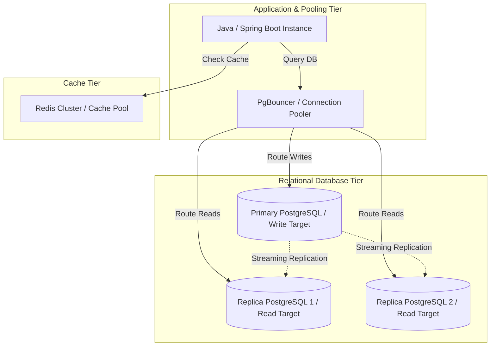

# System Design: PostgreSQL at Scale

When database traffic scales, the database tier often becomes the primary bottleneck. Because PostgreSQL uses a process-based model, managing connections, optimizing vacuum cycles, and routing traffic is essential to handle high-traffic loads. Scaling PostgreSQL at scale requires implementing connection pooling, tuning autovacuum configurations, routing requests dynamically, and optimizing caching tiers.

## Requirements

To handle high traffic loads while keeping query latency low and database connections stable, the database tier must satisfy the following criteria:

### Functional Requirements
*   **Connection Multiplexing**: Pool and reuse backend database connections to prevent memory exhaustion.
*   **Dynamic Traffic Routing**: Route writes to the primary database and reads to read-replicas.
*   **Automatic Vacuuming**: Reclaim storage space automatically without degrading query performance.

### Non-Functional Requirements
*   **Query Latency**: Keep database query latency under 50ms.
*   **Throughput Sizing**: Support thousands of concurrent queries without connection exhaustion.
*   **Maximized Read Availability**: Scale read capacity horizontally using database replicas.

---

## High-Level Architecture

A high-traffic PostgreSQL architecture uses PgBouncer proxies, caching pools, and replicas to decouple request handling from database operations:

---

## Design Deep Dive

### 1. Connection Pooling with PgBouncer
Since PostgreSQL spawns a separate process for each connection, running hundreds of concurrent client connections can exhaust system memory. Place **PgBouncer** in front of your database to manage connection routing:
-   **Transaction Pooling Mode (Recommended)**: PgBouncer assigns a database connection to a client only during a transaction. Once the transaction finishes, the connection is returned to the pool, allowing thousands of clients to share a small pool of database connections.
-   **Session Pooling Mode**: Maintains connections for the lifetime of client sessions, which consumes more resources.

### 2. Tuning Autovacuum for Write-Heavy Tables
PostgreSQL uses MVCC, creating a new row version for every update or delete. Autovacuum cleans up these dead row versions (garbage data) in the background. On write-heavy tables, default autovacuum settings can run too slow, causing table bloat and performance degradation. Tune these parameters to make autovacuum run more aggressively:
-   `autovacuum_vacuum_scale_factor`: The percentage of table modifications that triggers vacuuming (lower this value, e.g. to 0.05, to run vacuuming more frequently).
-   `autovacuum_vacuum_cost_limit`: Controls how much work autovacuum can perform before sleeping (raise this value to allow it to run faster).

### 3. Scaling Reads with Streaming Replication
Route read-only queries (`SELECT`) to read-replicas to distribute read traffic. Implement connection routing at the application level (e.g. using dynamic data sources in Spring Boot) or use database proxies to balance read queries across replicas automatically.

---

## Real-World Example
### How GitLab Scales PostgreSQL
GitLab manages massive database clusters in PostgreSQL. To scale, they use **PgBouncer** to handle thousands of concurrent application connections using transaction pooling. They route read-only traffic to multiple read-replicas, tune autovacuum parameters on write-heavy tables (like transaction logs) to prevent table bloat, and use **Patroni** to manage database clustering and automate failovers, maintaining high availability.

---

## Key Takeaways

*   Use PgBouncer in transaction pooling mode to handle high connection counts.
*   Scale read capacity horizontally using read-replicas.
*   Tune autovacuum settings on write-heavy tables to prevent table bloat.
*   Use Patroni to manage database clustering and automate failovers.
