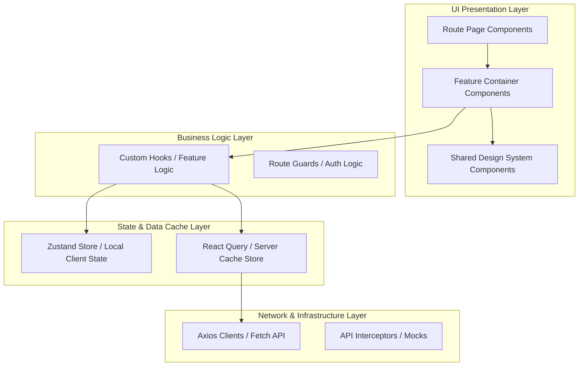

# System Design: Architecting a Large-Scale React Application

As React applications scale from small projects to massive enterprise codebases with hundreds of routes, thousands of components, and multiple engineering teams, they face critical architectural challenges. Without structured designs, code bases deteriorate into spaghetti code (due to prop drilling, bloated global states, and chaotic folder trees), build compile times skyrocket, and application rendering slows down. Architecting at scale requires implementing robust folder layouts, clean state boundaries, caching API layers, and optimized bundler pipelines.

## Requirements

To ensure stability, fast compilation, and high-performance user interfaces, a large-scale React application must satisfy the following architectural requirements:

### Functional Requirements
*   **Modular Feature Domain Structure**: Separate business domains (e.g. Checkout, User Management, Billing) to allow teams to work in parallel without code file conflicts.
*   **Decoupled Shared Component Library**: Maintain a centralized visual Design System (buttons, modals, input elements) separate from business domain logic.
*   **Query and API Caching Layer**: Abstract data fetching from UI presentation, providing state cache tracking and query revalidations.
*   **Centralized Localization & Routing**: Support modular dynamic routing, layout guards (auth gating), and multi-language assets loading.

### Non-Functional Requirements
*   **Fast Build & Bundle Compilation**: Local startup under 2s, and production bundle compilation under 3 minutes using incremental caching.
*   **Optimized Client Loading Performance**: First Contentful Paint (FCP) under 1.5s, achieved through lazy loading, assets caching, and dynamic module loading.
*   **Predictable Render Cycles**: Sliced state trees to prevent unneeded global re-renders.

---

## High-Level Architecture

Large-scale React applications are designed using a layered, feature-centric architecture. Instead of organizing files strictly by technical type (e.g., placing all hooks in one folder, all pages in another), files are grouped by business feature domains.



### Feature Folder Directory Structure
```text
src/
├── assets/          # Static logos, fonts, images
├── components/      # Global shared UI components (buttons, cards, forms)
├── config/          # Environment variables, app constants
├── features/        # Business feature modules (domain-driven)
│   ├── auth/
│   │   ├── api/     # API request hooks (React Query)
│   │   ├── components/ # Private components used only in Auth
│   │   ├── hooks/   # Private hooks
│   │   ├── stores/  # Private state stores
│   │   └── index.ts # Public API exports for other features
│   └── billing/
├── hooks/           # Global shared helper hooks (useDebounce, useAuth)
├── lib/             # Third-party wrappers (axiosClient, tailwindMerge)
├── routes/          # Centralized route definitions
└── utils/           # Helper helper functions (formatting, calculations)
```

---

## Design Deep Dive

### 1. Feature Isolation: The Public API Pattern
To prevent features from becoming tightly coupled, enforce strict import boundaries. Each feature folder exports an `index.ts` file which acts as its **Public API**. Other features can *only* import components or hooks exported via this `index.ts`. Directly importing a nested file (like `import { Button } from '@/features/auth/components/SubButton'`) is prohibited.
*   *Enforcement*: This boundary can be automated using ESLint rules (like `no-restricted-imports`).

### 2. Separation of State: Server vs. Client State
One of the biggest mistakes in large React codebases is keeping all data in a single global store. Split your state into three distinct buckets:
1.  **Local State**: UI toggles, active tabs, and form values should live inside the component using `useState`.
2.  **Server State**: Data fetched from APIs (user records, products list) should be managed by a server-cache library like **TanStack Query (React Query)**. It automatically handles caching, stale-while-revalidate (SWR) logic, retry buffers, and garbage collection.
3.  **Global Client State**: Values that truly transcend page boundaries and do not come from APIs (such as selected user theme, active shopping cart, or login session JWT) should be stored in a lightweight store like **Zustand**.

### 3. Monorepos at Scale
When multiple teams work on different applications that share common dependencies, they scale using a **Monorepo** structure managed by **Turborepo** or **Nx**. Code is split into reusable packages:
*   `apps/web`: The main Next.js documentation portal.
*   `apps/admin`: The internal administrator tool.
*   `packages/ui`: The shared component library (Design System).
*   `packages/hooks`: Common helper logic packages.

---

## Real-World Example

### How Netflix Scales React
Netflix manages its front-end interfaces across hundreds of devices (TVs, laptops, and phones) using a monorepo setup. They isolate UI components into a shared package (`packages/ui`) that leverages styled-components or design tokens, ensuring visual consistency. To optimize load times on bandwidth-constrained TV devices, they heavily utilize dynamic bundle loading and lazy import partitions. They also enforce strict ESLint rule checks to prevent cross-feature imports, allowing hundreds of developers to push changes to different micro-features daily without triggering cascade build errors.

---

## Key Takeaways

*   Organize codebases by feature domains (`features/`) instead of technical layers.
*   Use `index.ts` files as public API boundaries for feature domains.
*   Decouple Server API state (React Query) from Client UI state (Zustand).
*   Implement lazy loading and monorepo architectures to scale compilation times.
