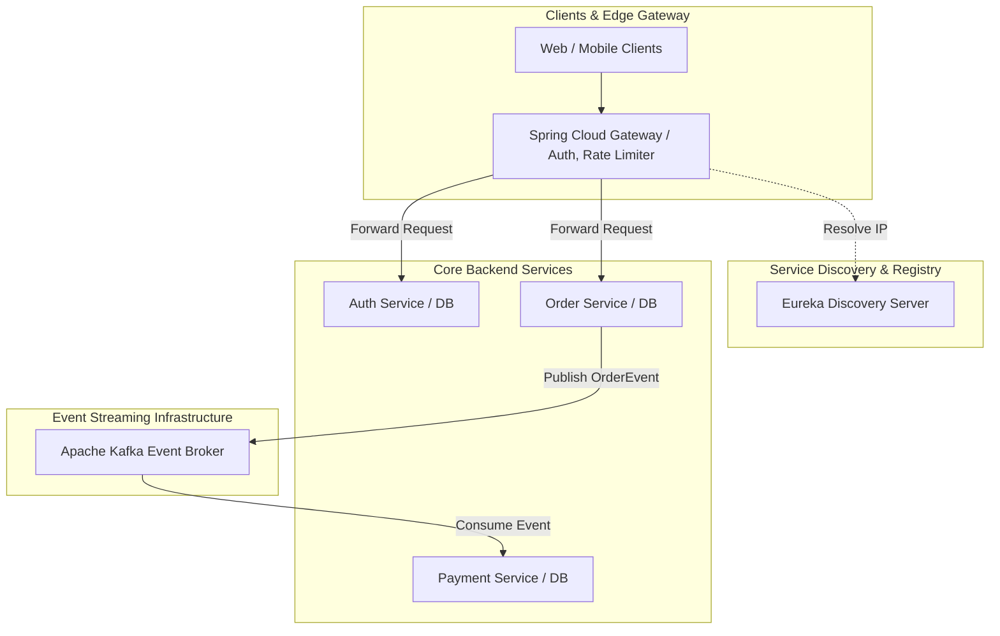

# System Design: Building Production-Grade Microservices

As backend applications scale to handle high traffic loads, monolithic architectures become difficult to maintain and scale. A production-grade **Microservices Architecture** solves this by splitting the application into separate, independent services. However, a distributed system introduces complex challenges: network failures, data consistency issues across databases, and service communication overhead. Designing a resilient, production-grade microservices system requires implementing robust service discovery, routing gateways, circuit breakers, and distributed tracing.

## Requirements

To support high availability, fault tolerance, and data consistency, the microservices system must meet the following criteria:

### Functional Requirements
*   **Centralized API Entry Point**: Intercept all client requests through an API Gateway to handle authentication, routing, and rate limiting.
*   **Dynamic Service Discovery**: Register and resolve service instances dynamically to support elastic scaling.
*   **Asynchronous Communication**: Decouple services using event-driven messaging for write operations.
*   **Distributed Database Patterns**: Maintain data isolation by providing each microservice with its own dedicated database.

### Non-Functional Requirements
*   **High Availability & Fault Isolation**: Ensure a failure in one service does not cascade and take down other services (fault containment).
*   **Distributed Observability**: Track request lifecycles across all service boundaries with minimal latency overhead.
*   **Data Consistency**: Enforce eventual consistency patterns (like the Saga Pattern) across services.

---

## High-Level Architecture

A production-grade microservices architecture uses a layered gateway routing model, utilizing service registries and event brokers to coordinate communication:

---

## Design Deep Dive

### 1. Resiliency Patterns: The Circuit Breaker
When a downstream service fails or runs slow, calling it repeatedly can exhaust thread pools on calling services. The **Circuit Breaker Pattern** prevents this by intercepting calls and managing states:
-   **Closed (Normal)**: Requests pass through to the downstream service.
-   **Open (Active Failure)**: If the error rate exceeds a set threshold, the circuit breaker trips. Subsequent calls fail immediately, returning fallback data without calling the failing service.
-   **Half-Open (Testing recovery)**: After a cool-down period, a limited number of requests are allowed through to test if the service has recovered.
Implement this in Spring Boot using **Resilience4j** configurations.

### 2. Distributed Data Consistency: Saga Pattern
Since each microservice owns its database, you cannot use standard database transactions (`@Transactional`) to enforce consistency across multiple services. Instead, implement the **Saga Pattern**:
-   A saga is a sequence of local transactions. Each transaction updates database state inside a single service and publishes an event.
-   Subsequent services listen to the event and execute their local transactions.
-   If a transaction fails, the saga executes **compensating transactions** (rollback steps) in reverse order to undo changes and restore data consistency.

### 3. Distributed Tracing: Observability at Scale
Debugging requests across dozens of microservices is difficult. Implement distributed tracing using **Micrometer Tracing** (formerly Spring Cloud Sleuth) and **Zipkin**:
-   **Trace ID**: A unique identifier assigned to a request at the API gateway that is passed in headers across all service calls.
-   **Span ID**: Represents a unit of work (e.g. database query, service call) within a single service.
This allows you to reconstruct and visualize the entire request flow in Zipkin to identify latency bottlenecks.

---

## Real-World Example

### How Netflix Built Eureka and Resiliency Tools
Netflix pioneered modern microservice patterns. They built **Eureka** for service discovery to manage dynamically scaling instances, and **Hystrix** (the predecessor to Resilience4j) to enforce circuit breaker patterns across services. Today, their systems process billions of events daily using distributed Kafka topics to decouple billing and recommendation pipelines, ensuring high availability even during network disruptions.

---

## Key Takeaways

*   Intercept all client requests through an API Gateway to handle authentication and routing.
*   Use circuit breakers (like Resilience4j) to isolate failures and maintain system availability.
*   Enforce eventual data consistency across services using Saga patterns.
*   Implement distributed tracing (Micrometer + Zipkin) to track requests across services.
