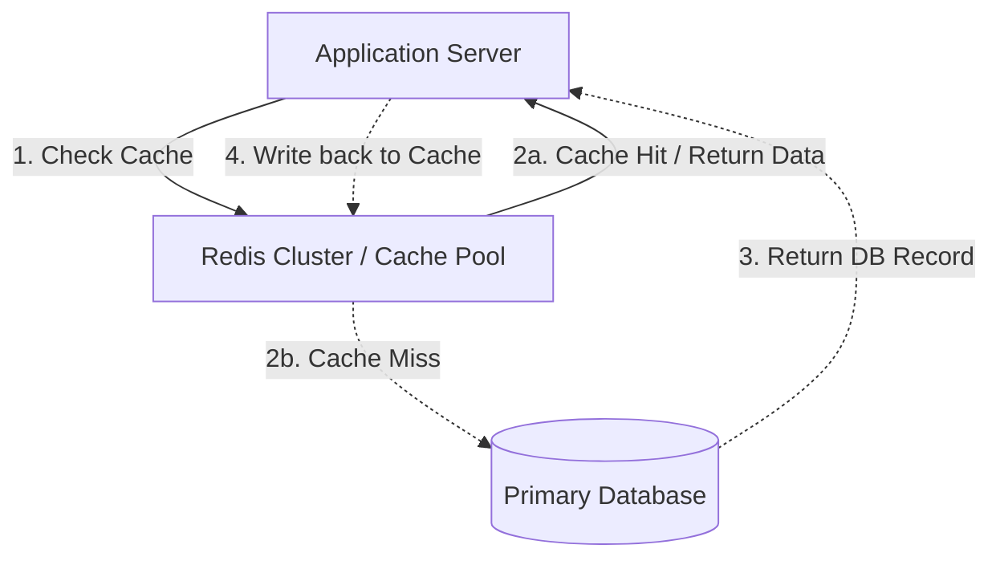

# System Design: Caching Strategies

Caching is the process of storing copies of data in a high-speed, temporary memory tier (like Redis or Memcached) to serve future requests faster. Caching offloads read traffic from primary databases, reduces latency, and protects backend infrastructure during traffic spikes.

## Requirements

To optimize read latency and maintain data consistency, a caching design must satisfy the following criteria:

### Functional Requirements
*   **Read Optimization**: Serve frequently queried data directly from memory, bypassing database lookups.
*   **Cache Invalidation**: Remove or update cached data when the primary database changes, preventing stale reads.
*   **Eviction Policies**: Reclaim memory automatically when the cache reaches storage limits.

### Non-Functional Requirements
*   **Low Cache Latency**: Serve cached data in sub-millisecond times.
*   **High Availability**: Ensure cache pools remain available under sudden traffic spikes.
*   **Data Consistency**: Balance data consistency between the cache and the primary database.

---

## High-Level Architecture

A scalable caching system uses the cache-aside pattern to intercept read queries and offload database reads:

---

## Design Deep Dive

### 1. Caching Patterns
-   **Cache-Aside (Recommended)**: The application checks the cache first. On a cache miss, it reads from the database, writes the result to the cache, and returns it to the user. Fast and simple, but can result in stale data if updates skip the cache.
-   **Write-Through**: The application writes updates to the cache and the database synchronously. Guarantees data consistency, but writes are slower because they must update both tiers.
-   **Write-Behind (Write-Back)**: The application writes updates to the cache immediately and returns. A background worker periodically batches and writes changes to the database asynchronously. Fast write performance, but creates data loss risks if the cache crashes before flushing updates to the database.

### 2. Cache Eviction Policies
When memory limits are reached, the cache must evict keys automatically using configured rules:
-   **LRU (Least Recently Used)**: Evicts keys that have not been accessed for the longest time. Ideal for most read-heavy workloads.
-   **LFU (Least Frequently Used)**: Evicts keys with the lowest access frequency count.
-   **FIFO (First-In, First-Out)**: Evicts keys in the order they were created, regardless of access patterns.

---

## Real-World Example
### How Twitter Scales Timelines Caching
Twitter uses massive Redis and Memcached clusters to cache user timelines. When a user logs in, their home timeline is fetched directly from cache pools in memory, bypassing database lookups. They use a write-through pattern, writing new tweets to user timelines in memory immediately, ensuring timelines update in real-time.

---

## Key Takeaways

*   Implement Cache-Aside to optimize read-heavy workloads, and Write-Behind for write-heavy workloads.
*   Use LRU eviction policies by default to reclaim memory automatically.
*   Configure a Time-to-Live (TTL) on cache keys to prevent data staleness.
*   Deploy cache nodes in clusters to ensure high availability and prevent single-point failures.
