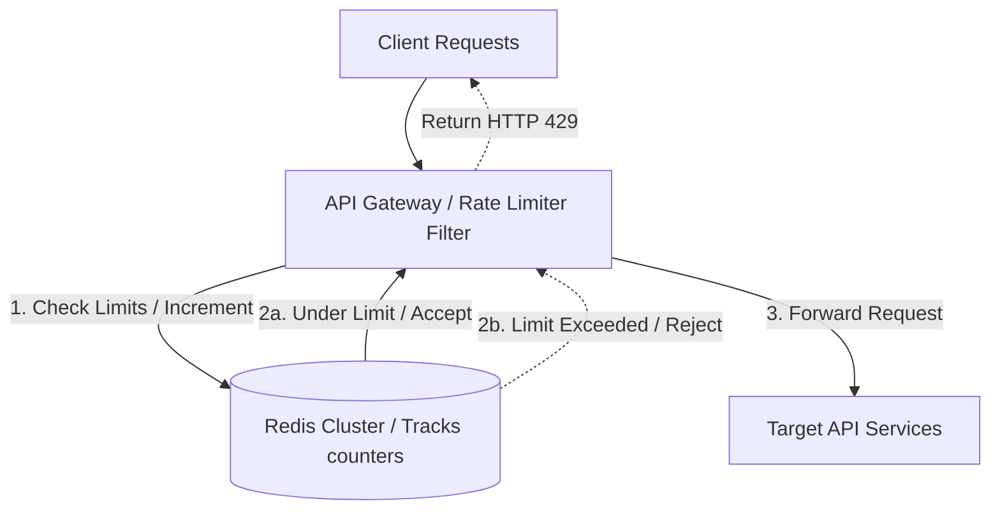

# Case Study: Rate Limiter

Designing a distributed rate limiter requires protecting backend APIs from DDoS attacks, API abuse, and resource exhaustion. The system must inspect incoming requests and reject traffic that exceeds configured limits with minimal latency overhead.

## Requirements

To enforce API limits while keeping latency low, a rate limiter system must satisfy the following criteria:

### Functional Requirements
*   **Limit Enforcements**: Intercept requests and reject traffic that exceeds configured limits (e.g. 100 requests per minute).
*   **HTTP Feedback**: Return an HTTP 429 Too Many Requests status code when limits are exceeded.

### Non-Functional Requirements
*   **Sub-Millisecond Overhead**: Enforce limits in under 2ms to prevent slowing down API requests.
*   **Distributed Synchronization**: Maintain consistent rate limit counts across dynamically scaling API nodes.
*   **Fault Tolerance**: Ensure API requests pass through if the rate limiter service itself crashes (fail-open).

---

## High-Level Architecture

A rate limiter sits at the gateway layer, using a fast Redis memory cache to track user request counters:

---

## Design Deep Dive
### 1. Core Rate Limiting Algorithms
-   **Token Bucket (Recommended)**: A bucket holds a maximum number of tokens, refilling at a constant rate. Each request consumes one token. If the bucket is empty, the request is rejected. Handles burst traffic well.
-   **Leaky Bucket**: Requests enter a queue and are processed at a constant output rate, smoothing out traffic spikes. Ideal for database write limits.
-   **Sliding Window Log**: Stores timestamps of user requests. When a request arrives, the system queries the logs, removing timestamps older than the active window to calculate request counts. Accurate, but consumes significant memory.

### 2. Distributed implementation using Redis
In distributed systems, API servers must share a centralized counter store. Use **Redis** for this:
-   Store user keys mapped to request counters (e.g. `user_101:count`).
-   Use Redis Lua scripts to execute counter checks and increments atomically, preventing race conditions from concurrent requests.

---

## Real-World Example
### How Stripe Enforces API Limits
Stripe handles millions of financial transactions daily. They implement a distributed rate limiter at the gateway layer using **Redis** clusters to track request counters atomically. They configure token bucket algorithms to support burst traffic from users while blocking malicious traffic, ensuring service availability.

---

## Key Takeaways

*   Use Token Bucket algorithms to support burst traffic, and Leaky Bucket to smooth write traffic.
*   Store and update rate limit counters atomically in Redis to prevent race conditions.
*   Return HTTP 429 status codes with header details when limits are exceeded.
*   Configure rate limiters to fail-open during crashes to protect system availability.
