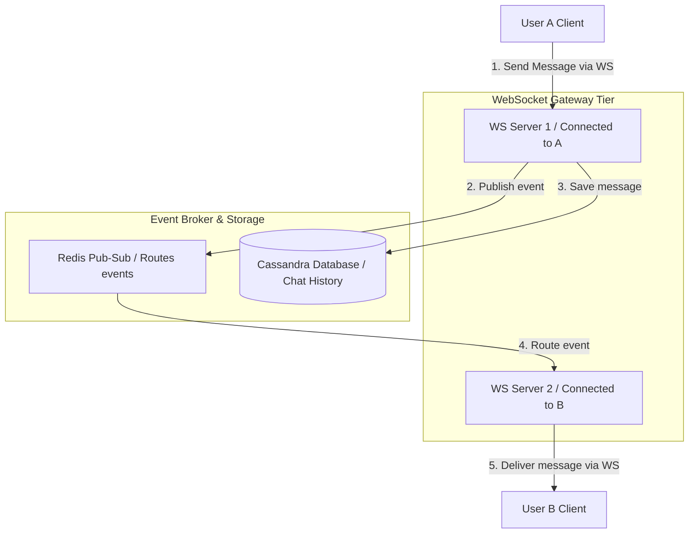

# Case Study: Real-Time Chat App

Designing a real-time chat application (like Slack or WhatsApp) requires addressing persistent connection scaling, message delivery guarantees, and presence status synchronization. The system must support persistent, bi-directional connections to deliver messages instantly.

## Requirements

To deliver messages instantly and support millions of concurrent connections, a real-time chat system must satisfy the following criteria:

### Functional Requirements
*   **Instant Messaging**: Deliver chat messages between users in real-time.
*   **Presence Status**: Display active/offline user indicators in real-time.
*   **Message Status**: Track message delivery status (Sent, Delivered, Read).

### Non-Functional Requirements
*   **Low Message Latency**: Deliver messages in under 100 milliseconds.
*   **Persistent Connection Scaling**: Scale server nodes to support millions of active WebSocket connections.
*   **Message Ordering**: Guarantee messages are displayed in the correct chronological order.

---

## High-Level Architecture

The system routes WebSocket connections through gateway nodes, using Redis Pub/Sub to coordinate messages across servers:

---

## Design Deep Dive
### 1. WebSocket Connection Scaling
Unlike standard HTTP requests that close immediately, WebSockets require persistent, bi-directional TCP connections. To scale connection nodes:
-   Use a Layer 7 load balancer configured with round-robin routing to distribute connections across WebSocket servers.
-   Maintain a centralized **User Session Mapping** store in Redis (e.g. mapping `user_id` to `websocket_server_ip`) so servers know where to route messages.
-   If User A sends a message to User B, WS Server 1 queries Redis to find User B's server, and publishes the message to a shared **Redis Pub/Sub** channel to route it to WS Server 2.

### 2. Presence Status Synchronization
Displaying user status (online/offline) in real-time requires active presence checks:
-   Clients send a "heartbeat" ping to presence servers periodically (e.g. every 5 seconds).
-   The presence server stores the user's active status in Redis with a short TTL (e.g. 10 seconds).
-   If a heartbeat ping is missed, the TTL expires, and the presence server publishes an offline status event to the user's friends list.

---

## Real-World Example
### How Discord Scales WebSocket Connections
Discord supports millions of concurrent voice and text chat connections. They use Elixir and Go to write high-performance gateway nodes that manage WebSocket connections, routing messages through distributed queue systems to deliver messages instantly. They use Redis clusters to manage user presence status and session mappings, ensuring high availability.

---

## Key Takeaways

*   Use WebSockets to support bi-directional real-time communication.
*   Manage session mappings in Redis to route messages across WebSocket servers.
*   Store chat history in a NoSQL database (like Cassandra) to support high write volumes.
*   Implement periodic heartbeat pings to manage presence status in real-time.
