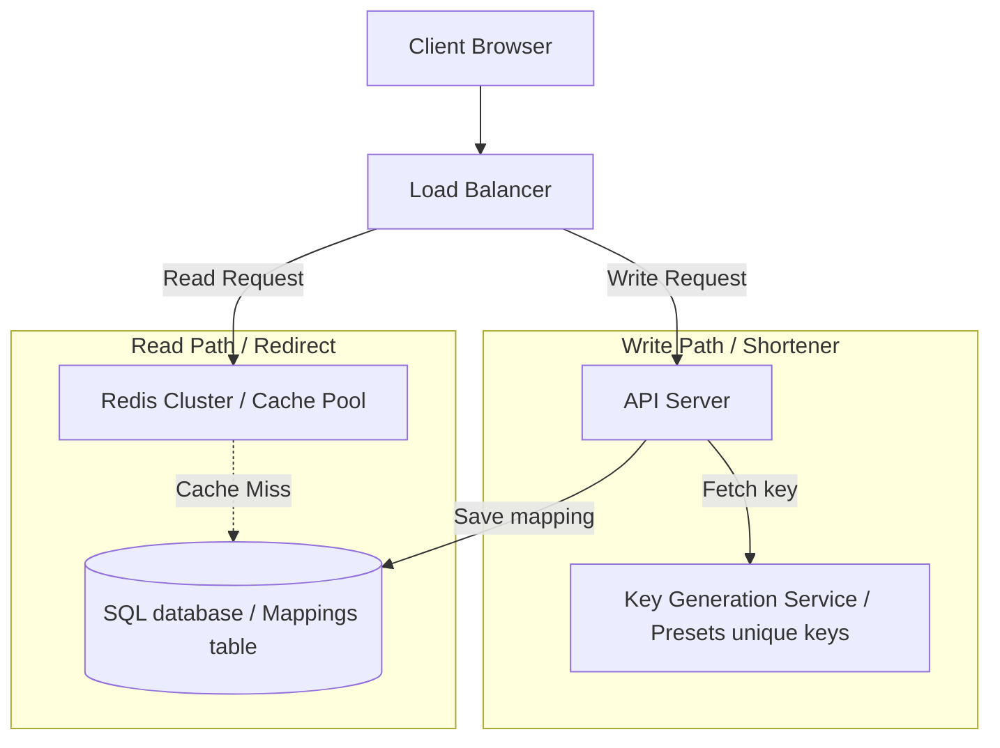

# Case Study: URL Shortener

Designing a high-performance URL shortener (like TinyURL) requires addressing unique ID generation, fast redirections, and caching configurations. The system must generate short, unique alias links for long URLs and redirect users to original destinations in sub-millisecond times.

## Requirements

To support millions of daily write and read operations, a URL shortener system must satisfy the following criteria:

### Functional Requirements
*   **URL Shortening**: Generate a short, unique alias (e.g. 7 characters) for a given long URL.
*   **Redirect Link**: Redirect users accessing the short alias to the original URL destination (HTTP 301/302 Redirect).

### Non-Functional Requirements
*   **Ultra-Low Read Latency**: Serve redirection lookups in under 10 milliseconds.
*   **High Write Availability**: Ensure the short link generator remains online under load.
*   **Uniqueness**: Guarantee that short aliases never collide.

---

## High-Level Architecture

The system routes writes to a Key Generation Service and caches short links in Redis to optimize read speeds:

---

## Design Deep Dive

### 1. Key Generation Service (KGS)
To prevent collisions during concurrent write operations, use a dedicated **Key Generation Service (KGS)**:
-   The KGS pre-generates a pool of unique, random string keys (e.g. using Base62 encoding, containing characters a-z, A-Z, 0-9) and stores them in a key table.
-   When a user requests a short URL, the API server fetches an unused key from the KGS pool, marking it as used.
-   This eliminates key generation calculations and locks during write operations, preventing collisions.

### 2. HTTP Redirection: 301 vs. 302
-   **HTTP 301 (Permanent Redirect)**: The client browser caches the redirection mapping. Subsequent clicks skip the shortener API, loading the destination directly. Reduces load on the API but prevents capturing click analytics.
-   **HTTP 302 (Temporary Redirect)**: The client browser is forced to query the shortener API on every click. Increases load on the system but allows capturing detailed click analytics.

---

## Real-World Example
### How Bitly Scales URL Redirections
Bitly processes billions of link clicks monthly. They route read traffic through distributed caching pools (using Redis) to resolve redirections in sub-millisecond times, avoiding database hits for popular links. They use HTTP 302 redirects to capture user geographic data and analytics before forwarding clients to original destinations, ensuring high availability.

---

## Key Takeaways

*   Use a Key Generation Service (KGS) to prevent key collisions during concurrent writes.
*   Store URL mappings in a NoSQL database (like Cassandra) to support high write volumes.
*   Cache popular link mappings in Redis to optimize read latency.
*   Use HTTP 302 redirects when click analytics are required; use 301 to reduce server load.
