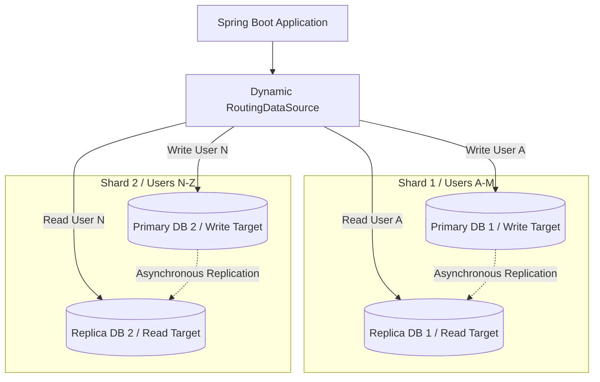

# System Design: Database Sharding & Replication

When applications scale, the database tier eventually hits processing and storage limits. Unlike stateless application servers, database engines must maintain state, requiring replication (copying data to multiple read nodes) and sharding (partitioning tables horizontally across hosts) to handle high-traffic loads.

## Requirements

To scale database capacity while keeping query latency low and data consistent, the database architecture must satisfy the following criteria:

### Functional Requirements
*   **Read Scaling**: Scale read operations horizontally using database replicas.
*   **Write Partitioning**: Distribute write operations across database shards using sharding keys.
*   **Dynamic Connection Routing**: Route queries to the appropriate database node dynamically based on transaction types.

### Non-Functional Requirements
*   **Data Consistency**: Enforce data consistency controls across replicas and shards.
*   **High Availability**: Ensure failover systems promote replicas automatically during primary node failures.
*   **Minimal Sharding Overhead**: Prevent cross-shard joins and distributed transaction bottlenecks.

---

## High-Level Architecture

A scalable database architecture routes writes to primary write nodes and reads to read-replicas, sharding tables horizontally to distribute storage loads:

---

## Design Deep Dive

### 1. Primary-Replica Replication
Replication duplicate database updates across multiple nodes to distribute read traffic:
-   **Writes**: Routed to the primary node, which logs updates to its binary log (`binlog`).
-   **Reads**: Routed to read-replicas, which read and apply changes from the primary's binlog asynchronously.
-   **Replication Lag**: The delay between updates appearing on the primary and replication to replicas. Can cause stale reads if not managed correctly.

### 2. Database Sharding (Horizontal Partitioning)
Sharding divides a massive table horizontally, routing rows to separate database servers based on a sharding key:
-   **Range Sharding**: Routes rows based on value ranges (e.g. users 1–1M to Shard 1, 1M–2M to Shard 2). Simple, but can create hot spot shards if data is not distributed evenly.
-   **Hash Sharding**: Hashes the sharding key modulo the number of shards (e.g. `hash(user_id) % 4`) to distribute data evenly. Makes adding shards complex because it requires re-sharding all keys.

---

## Real-World Example
### How Slack Scales Database Layers
Slack manages massive workspaces data. To scale, they shard database clusters using a custom application layer called **Vitess** (originally built by YouTube). Vitess handles database connections and partitions tables horizontally across MySQL shards automatically, routing queries dynamically based on workspace IDs and ensuring high availability.

---

## Key Takeaways

*   Primary-Replica replication scales read capacity; sharding scales write capacity.
*   Use Bounces or Proxies (like Vitess) to manage database connections and routing at scale.
*   Select a high-cardinality sharding key to distribute data evenly across shards.
*   Route critical reads to the primary database to mitigate replication lag.
