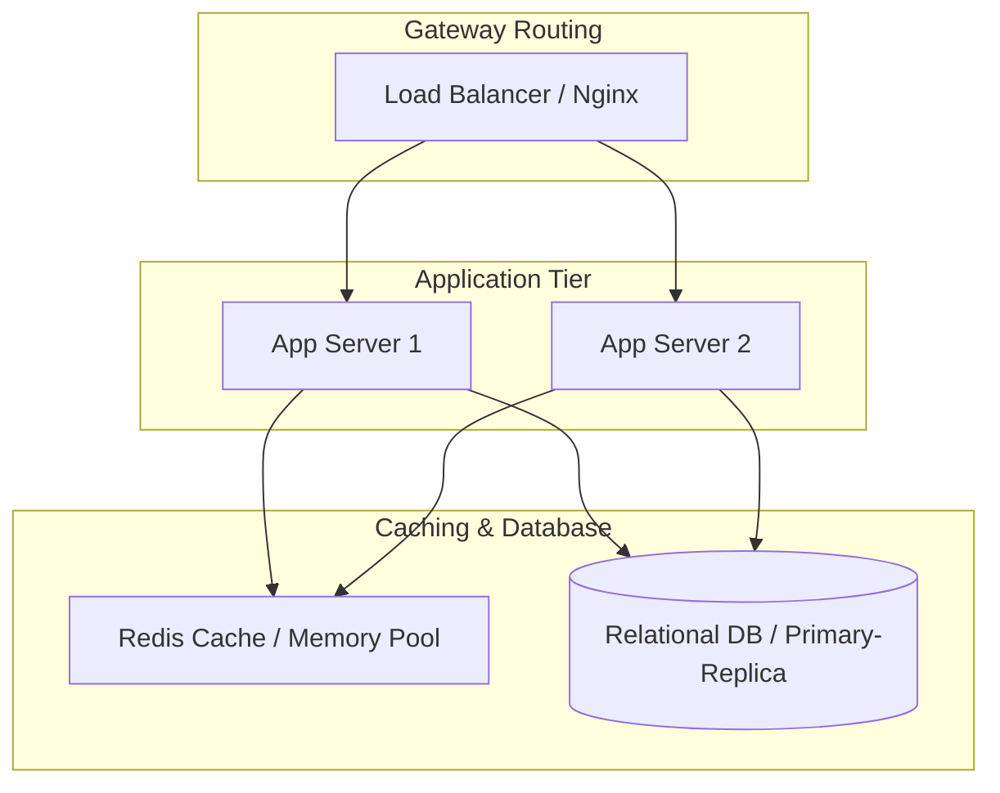

# System Design: Fundamentals

System Design is the process of defining the architecture, components, and data interfaces for a software system to satisfy specific scaling requirements. Modern backend systems must balance performance, consistency, and availability when scaling to millions of concurrent users.

## Requirements

To build reliable, scalable architectures, a system design must satisfy the following criteria:

### Functional Requirements
*   **Dynamic Scaling**: Scale compute and storage capacity dynamically to handle traffic loads.
*   **Resource Isolation**: Isolate failures to prevent single components from bringing down the entire system.
*   **Observable Performance**: Monitor metrics (latency, throughput) to identify bottlenecks.

### Non-Functional Requirements
*   **High Availability**: Target a 99.999% uptime ("five nines") to minimize service downtime.
*   **Low Latency**: Maintain p99 latency under 100ms for client requests.
*   **Consistency Trade-offs**: Balance data consistency and system availability using the CAP theorem.

---

## High-Level Architecture

A scalable system design uses load balancers, caching tiers, and database clusters to distribute requests and manage data states:

---

## Design Deep Dive

### 1. Vertical vs. Horizontal Scaling
-   **Vertical Scaling (Scaling Up)**: Adding more power (CPU, RAM) to a single server. Simple, but limited by hardware boundaries and creates a single point of failure.
-   **Horizontal Scaling (Scaling Out)**: Adding more servers to the pool. Scales infinitely and ensures fault tolerance, but requires load balancers and complex distributed architectures.

### 2. Latency vs. Throughput
-   **Latency**: The time taken to process a single request (measured in milliseconds).
-   **Throughput**: The number of requests the system can handle per second (measured in Requests Per Second, or RPS).

### 3. The CAP Theorem
In a distributed data system, you can only guarantee two of the following three properties:
-   **Consistency**: Every read receives the most recent write or an error.
-   **Availability**: Every non-failing node returns a non-error response (without guaranteeing it contains the most recent write).
-   **Partition Tolerance**: The system continues to operate despite network partition drops.
Because physical networks inevitably drop messages (requiring Partition Tolerance), you must choose between **Consistency (CP)** or **Availability (AP)** during network partitions.

---

## Real-World Example
### How Amazon Balances CAP Trade-offs
Amazon's shopping cart system chooses Availability over Consistency (AP). If a network partition occurs, users can still add items to their shopping carts (high availability). The system resolves any cart data conflicts later when the network partition heals, prioritizing user checkouts over strict data consistency.

---

## Key Takeaways

*   Horizontal scaling distributes processing loads, removing single points of failure.
*   Scale read operations horizontally using replicas; writes require partitioning.
*   Under network partitions, distributed systems must choose between Consistency (CP) or Availability (AP).
*   Prioritize non-functional requirements (p99 latency bounds) during architectural planning.
