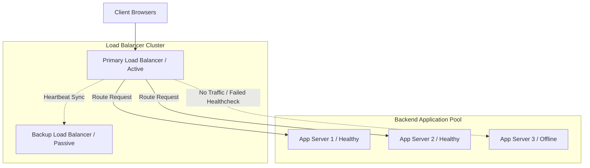

# System Design: Load Balancing

Load Balancing is the practice of distributing incoming network traffic across multiple backend servers. By preventing any single server from becoming a bottleneck, load balancers optimize resource utilization, maximize throughput, and ensure high availability.

## Requirements

To distribute traffic efficiently and support elastic scaling, a load balancing design must satisfy the following criteria:

### Functional Requirements
*   **Traffic Distribution**: Route incoming client requests across active backend servers.
*   **Health Check Monitoring**: Query backend instance health periodically, routing traffic away from failed nodes.
*   **SSL Termination**: Decrypt SSL connections at the load balancer layer to offload processing from application servers.

### Non-Functional Requirements
*   **High Availability**: Ensure the load balancer itself does not become a single point of failure (using active-passive pairs).
*   **Low Routing Overhead**: Minimize latency overhead during packet forwarding.
*   **Session Persistence**: Support sticky sessions (routing a user's requests to the same backend server) when required.

---

## High-Level Architecture

Load balancers sit between client devices and backend application pools, routing requests based on server health stats:

---

## Design Deep Dive

### 1. Routing Algorithms
Load balancers use specific routing algorithms to distribute traffic:
-   **Round Robin**: Routes requests sequentially across the server pool. Simple, but assumes all servers have identical hardware capacities.
-   **Least Connections**: Routes requests to the server with the fewest active connections. Ideal for long-running transactions.
-   **IP Hash**: Hashes the client's IP address to determine the target server, ensuring a client always routes to the same server (session persistence).

### 2. Layer 4 vs. Layer 7 Load Balancing
-   **Layer 4 (Transport Layer)**: Routes traffic based on network protocol information (IP addresses and TCP/UDP ports). Fast and resource-efficient because it does not inspect packet contents.
-   **Layer 7 (Application Layer)**: Inspects HTTP headers, cookies, and message payloads to route traffic (e.g. routing `/api/users` requests to user services and `/static` requests to image servers). Requires more processing power but enables flexible, content-aware routing.

---

## Real-World Example
### How NGINX Scales Web Platforms
NGINX is widely used as a Layer 7 load balancer and reverse proxy. It routes client requests across backend pools using least-connections algorithms, terminates SSL connections at the gateway layer, and caches static assets to offload work from application servers, maintaining high availability for millions of users.

---

## Key Takeaways

*   Load balancers distribute traffic across backend pools to prevent single-instance bottlenecks.
*   Layer 4 routes traffic based on IP/Port data; Layer 7 routes based on application payload data.
*   Use least-connections algorithms to distribute long-running transactions efficiently.
*   Deploy load balancers in active-passive pairs to prevent single points of failure.
