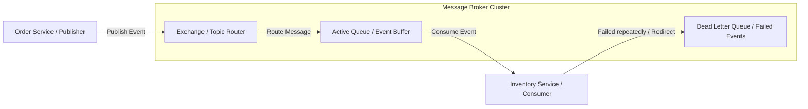

# System Design: Message Queues

Message Queues decouple microservices, allowing them to communicate asynchronously using message brokers (like RabbitMQ or Apache Kafka). By enabling event-driven communication, message queues improve system scalability, resilience, and write performance.

## Requirements

To process events asynchronously and maintain data consistency across services, a message queue design must satisfy the following criteria:

### Functional Requirements
*   **Asynchronous Processing**: Decouple services by publishing event payloads rather than waiting for synchronous HTTP responses.
*   **Reliable Delivery**: Guarantee messages are not lost during network drops or subscriber failures.
*   **Dead Letter Queues**: Route failed messages to a Dead Letter Queue (DLQ) for manual inspection.

### Non-Functional Requirements
*   **High Throughput**: Support thousands of messages per second under load.
*   **Fault Tolerance**: Ensure the message broker cluster remains available if individual broker nodes crash.
*   **Data Consistency**: Enforce idempotent message processing to prevent duplicate updates.

---

## High-Level Architecture

A message queue decouples publishers from consumers, utilizing message brokers to buffer and route events:

---

## Design Deep Dive

### 1. Messaging Models: Pub-Sub vs. Message Queue
-   **Point-to-Point Message Queue**: Messages are delivered to exactly one consumer in a worker pool. Once processed, the message is deleted from the queue.
-   **Publish-Subscribe (Pub-Sub)**: Messages are published to a topic and broadcast to all active subscriber groups. Each subscriber group receives a copy of the message, enabling multi-service event handling.

### 2. Message Delivery Guarantees
Message brokers offer different delivery guarantees based on configurations:
-   **At-Most-Once**: Messages are sent once; they may be lost but are never duplicated.
-   **At-Least-Once (Standard)**: Messages are guaranteed to be delivered, but network drops can cause duplicate deliveries. Consumers must handle duplicate events safely (**Idempotency**).
-   **Exactly-Once**: Messages are delivered exactly once. Requires complex coordination and slows down processing throughput.

---

## Real-World Example
### How LinkedIn Scales Event Streams with Kafka
LinkedIn created Apache Kafka to manage massive event streams. Today, they process trillions of events daily (user actions, search logs, metrics) using Kafka. Multiple downstream services (recommendation engines, security logs, analytics) subscribe to these topics in parallel, processing event streams asynchronously without slowing down primary application databases.

---

## Key Takeaways

*   Message brokers decouple microservices, allowing them to communicate asynchronously.
*   RabbitMQ is ideal for complex routing; Kafka is built for high-throughput event streaming.
*   Design consumer methods to be idempotent to handle duplicate events safely.
*   Always configure Dead Letter Queues (DLQ) to route and isolate failed messages.
