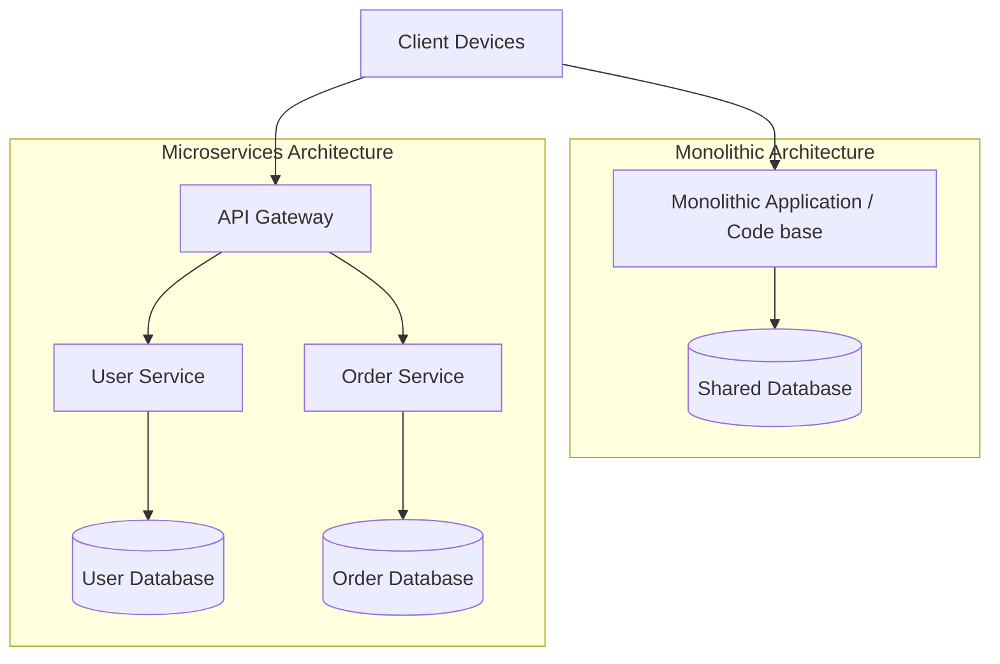

# System Design: Microservices vs. Monolith

Choosing between a Monolithic and a Microservices architecture is a fundamental system design decision. While monoliths are simpler to build and deploy initially, microservices offer team autonomy, independent scaling, and fault isolation as applications grow.

## Requirements

To coordinate distributed microservices and manage data consistency, the system design must satisfy the following criteria:

### Functional Requirements
*   **Independent Deployments**: Allow different developer teams to deploy service updates independently.
*   **Centralized API Access**: Route client requests through an API Gateway to handle authentication.
*   **Service Isolation**: Maintain data isolation by providing each microservice with its own dedicated database.

### Non-Functional Requirements
*   **Fault Tolerance**: Ensure a failure in one service does not cascade and take down other services.
*   **Eventual Data Consistency**: Enforce data consistency across service databases using Saga patterns.
*   **Distributed Observability**: Track request lifecycles across service boundaries with minimal latency overhead.

---

## High-Level Architecture

A microservices architecture splits application logic into separate, independent services, routing client requests through an API Gateway:

---

## Design Deep Dive

### 1. Monolith vs. Microservices Trade-offs
-   **Monolith**: Simplifies development, database transactions (`@Transactional`), and deployments. However, it scales poorly as team size grows, creates single points of failure, and can lead to code coupling.
-   **Microservices**: Promotes team autonomy, independent scaling, and fault isolation. However, it introduces network latency, distributed data consistency challenges, and operational complexity.

### 2. Distributed Transactions: The Saga Pattern
Since each microservice owns its database, you cannot use standard database transactions to enforce consistency across services. Instead, implement the **Saga Pattern**:
-   A saga is a sequence of local transactions. Each transaction updates database state inside a single service and publishes an event.
-   Subsequent services listen to the event and execute their local transactions.
-   If a transaction fails, the saga executes **compensating transactions** (rollback steps) in reverse order to undo changes and restore data consistency.

---

## Real-World Example
### How Netflix Migrated to Microservices
Netflix migrated from a monolithic architecture to microservices to support their rapidly growing user base. They isolated application logic into thousands of microservices, routing traffic through an API gateway, scaling instances dynamically, and utilizing circuit breakers to prevent localized service failures from taking down the entire platform.

---

## Key Takeaways

*   Monoliths are simpler to build initially; microservices scale better as teams grow.
*   Maintain data isolation by giving each microservice its own dedicated database.
*   Enforce eventual data consistency across services using Saga patterns.
*   Route client requests through an API Gateway to handle authentication and routing.
